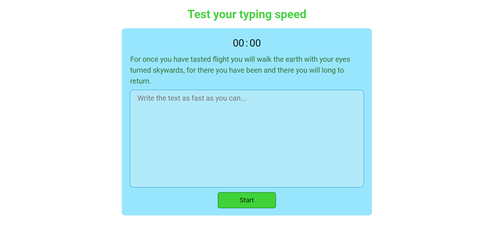
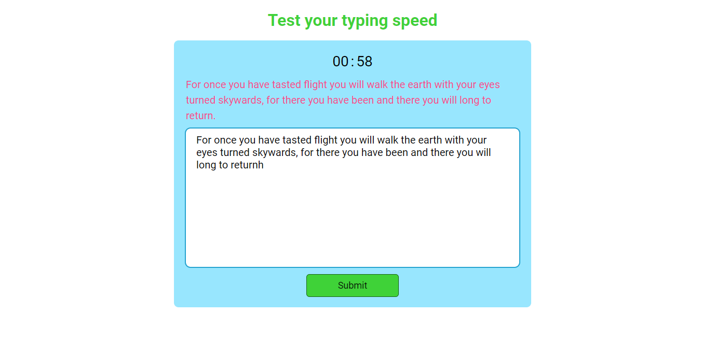
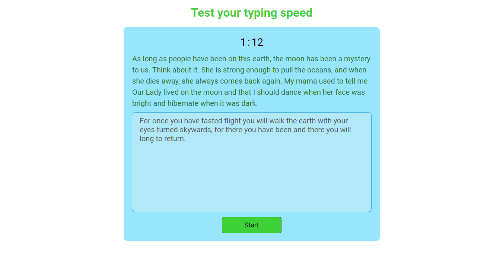

## Overview

[Check out](https://10xtyping.netlify.app/)

### This is typing speed meter . I build it using html, css and javascript. If user made any mistake, the paragraph color will be red and after finish the paragraph the submit button will activate.
